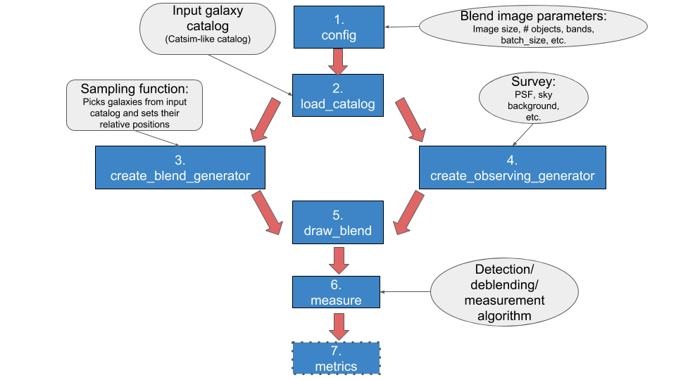

# BlendingToolKit
Framework for fast generation and analysis of galaxy blends catalogs. This toolkit is a convenient way of
producing multi-band postage stamp images of blend scenes.

Documentation can be found at https://blendingtoolkit.readthedocs.io/en/latest/

## Workflow

## Running BlendingToolKit
- BlendingToolKit (btk) requires an input catalog that contains information required to simulate galaxies and blends.
This repository includes sample input catalogs with a small number of galaxies that can be used to draw blend images with btk. See [tutorials](https://github.com/LSSTDESC/BlendingToolKit/tree/master/notebooks) to learn how to run btk with these catalogs.
- Catalog corresponding to one square degree of sky and pre-processed WeakLensingDeblending catalogs can be downloaded from [here](https://stanford.app.box.com/s/s1nzjlinejpqandudjyykjejyxtgylbk).

## Requirements
The code is intended to run in python >=3.6.
To run btk you need to install
- [WeakLensingDeblending](https://github.com/LSSTDESC/WeakLensingDeblending)
- [GalSim](https://github.com/GalSim-developers/GalSim/)
- numpy
- astropy
- fitsio
- scipy
- lmfit

More detailed installation instructions can be found [here](https://blendingtoolkit.readthedocs.io/en/latest/install.html).

### Optional
The tutorials include examples of using btk with some detection, deblending or measurement packages including
- [scarlet](https://github.com/fred3m/scarlet/) (multi-band deblender)
- [sep](https://sep.readthedocs.io/en/v1.0.x/index.html) (Source Extraction and Photometry)
- [lsst](https://pipelines.lsst.io) (LSST science pipeline)
