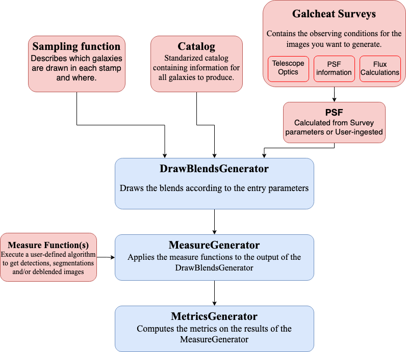

# BlendingToolKit


[](https://github.com/LSSTDESC/BlendingToolKit/actions/workflows/notebooks.yml)
[](https://codecov.io/gh/LSSTDESC/BlendingToolKit)
[](https://github.com/psf/black)
[](https://github.com/pre-commit/pre-commit)
[![PyPI][pypi-badge]][pypi]
[](https://mybinder.org/v2/gh/LSSTDESC/BlendingToolKit/main?labpath=notebooks%2F00-intro.ipynb)

[pypi-badge]: <https://img.shields.io/pypi/pyversions/blending-toolkit?color=yellow&logo=pypi>
[pypi]: <https://pypi.org/project/blending-toolkit/>

## Summary

Framework for fast generation and analysis of galaxy blends catalogs. This toolkit is a convenient way of
producing multi-band postage stamp images of blend scenes.

Documentation can be found at <https://lsstdesc.org/BlendingToolKit/index.html>

## Workflow



- In red are the BTK objects that can be customized in various ways by BTK users.

## Running BlendingToolKit

- BlendingToolKit (btk) requires an input catalog that contains information required to simulate galaxies and blends.
This repository includes sample input catalogs with a small number of galaxies that can be used to draw blend images with btk. See [tutorials](https://github.com/LSSTDESC/BlendingToolKit/tree/main/notebooks) to learn how to run btk with these catalogs.
- CatSim Catalog corresponding to one square degree of sky and processed WeakLensingDeblending catalogs can be downloaded from [here](https://stanford.app.box.com/s/s1nzjlinejpqandudjyykjejyxtgylbk).
- [Cosmo DC2](https://arxiv.org/abs/1907.06530) catalog requires pre-processing in order to be used as input catalog to btk. Refer to this [notebook](https://github.com/LSSTDESC/WeakLensingDeblending/blob/cosmoDC2_ingestion/notebooks/wld_ingestion_cosmoDC2.ipynb) on how to convert the DC2 catalog into a CatSim-like catalog that can be analyzed with btk.

## Installation

BTK is pip installable, with the following command:

```bash
pip install blending_toolkit
```

Although you might run into problems installing `galsim`. In case of any issues, please see the more detailed installation instructions [here](https://lsstdesc.org/BlendingToolKit/install.html).

For required packages, see the [requirements.txt](https://github.com/LSSTDESC/BlendingToolKit/blob/main/requirements.txt) file.

## Tutorial

You can check out our introduction tutorial and get acquainted with BTK in a binder instance (no installation required) by simply clicking [here](https://mybinder.org/v2/gh/LSSTDESC/BlendingToolKit/main?labpath=notebooks%2F00-intro.ipynb).

## Contributing

See [CONTRIBUTING.md](https://github.com/LSSTDESC/BlendingToolKit/blob/main/CONTRIBUTING.md)
