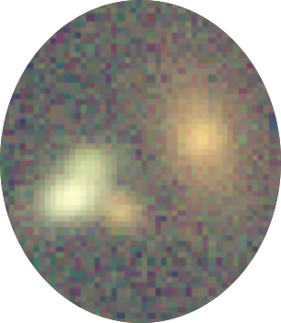

.. btk documentation master file, created by
   sphinx-quickstart on Tue Mar 19 15:40:17 2019.
   You can adapt this file completely to your liking, but it should at least
   contain the root `toctree` directive.

:tocdepth: 3

*BlendingToolKit*
===============================
*BlendingToolKit* (btk) is a framework to generate images of blended objects and
evaluate performance metrics for different algorithms.

Detecting and separating overlapping sources, or "deblending", is primarily a research problem with several potential algorithmic solutions, including machine learning approaches. Computation of performance metrics on identical datasets will enable comparison between different algorithms. The goals of the btk framework are to allow the user to easily and quickly generate datasets of blended objects for testing different algorithms, as well as training samples for machine learning algorithms.

Key features or functionalities of the framework include:

* generation of training/validation/test sets for developing and testing detection, deblending and measurement algorithms.
* data augmentation and independent (but reproducible) noise realizations.
* customization options for including user-defined functions for blend generation, observing conditions, etc., and for producing images on the fly.

Getting Started
==================
.. toctree::
   :maxdepth: 1

   install
   catalog
   tutorials
   user_guide

Modules API Reference
---------------------

.. toctree::
   :maxdepth: 2

   src/btk
