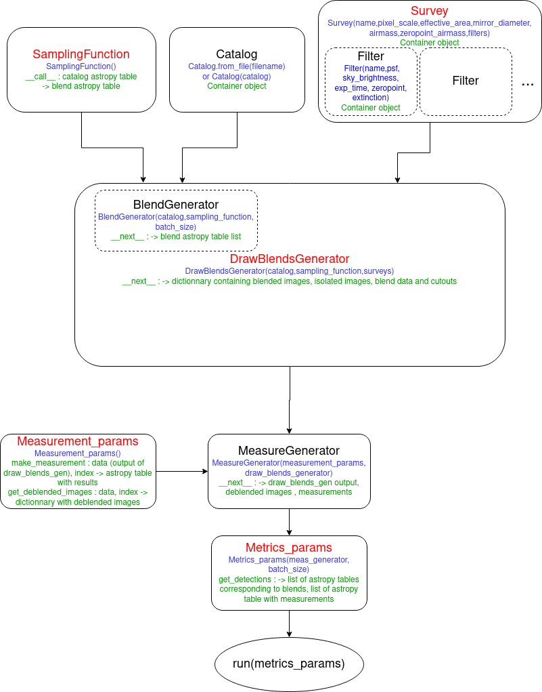

User Guide
==============

This document gives a detailed look into the work-flow of *BlendingToolKit* (btk). For a quick tutorial on how to run btk, see the jupyter notebook tutorials `here <tutorials.html>`_. This page is especially useful if you plan to use btk with your own detection/deblending/measurement algorithm. The workflow presented here should be as general as possible ; examples for the WeakLensingDeblending case are also given.

The workflow of btk is shown here:

1. Set parameter values : define parameter values to create postage stamps, including size of stamp, number of objects per blend, and how many stamps are to be drawn in one batch -- i.e., the number of stamps btk will produce together in a singe batch. The observing survey name (e.g., LSST, DES), the name of the input catalog to draw objects from, and the names of the observing bands are also specified here. 
2. Load Catalog : Reads the input catalog file. This must be done using a :class:`~btk.catalog.Catalog`-like object (e.g. :class:`~btk.catalog.WLDCatalog`), either by providing directly the catalog or by using the :meth:`~btk.catalog.Catalog.from_file` method. Additionally, the catalog can be filtered using the :meth:`~btk.catalog.Catalog.apply_selection_function` method and providing an appropriate selection function.
3. (optional) Define your own :class:`~btk.sampling_functions.SamplingFunction`. A sampling function is a callable object, which takes into input a catalog and returns specific entries along with parameters for a given blend (such as object shifts in the stamp for instance). You may use the default class :class:`~btk.sampling_functions.DefaultSamplingFunction`, or define a new one if you want to have more control over how the galaxies are selected and the blends are defined.
4. (optional) Define your own :class:`~btk.survey.Survey`. A survey is a namedtuple containing different attributes relating to the observing conditions of a given survey, such as the pixel scale, and several :class:`~btk.survey.Filter` instances, which are also namedtuples containing attributes corresponding to the different filters of the survey (eg the exposition time or the sky brightness). PSF information is also contained in each of the :class:`~btk.survey.Filter` instance. You may either use one of the default surveys already defined in btk.survey, or define your own survey to have more control of the parameters. Images for several surveys may also be produced by replacing the survey object by a list of survey objects.
5. Draw blends : Simulates scene of overlapping objects, convolved by the PSF and with pixel noise. This step is done by creating a :class:`~btk.draw_blends.DrawBlendsGenerator`-like object (e.g. :class:`~btk.draw_blends.WLDGenerator`), which is given the catalog, sampling function and survey created in step 2 to 4. It can then be called using *next(<draw blends generator>)* to get the results as a dictionary, including the blends with the key *blend_images*, the isolated galaxy images with the key *isolated_images* and the blend parameters with the key *blend_list*. In the case where multiple surveys were provided in step 4, the results will instead take the form of a dictionary indexed by the survey names, each entry containing a dictionary with the aforementioned entries.

Please note that this part of BTK is bound to be modified in the near future.

6. Detection/Deblending/Measure : Performs user-defined measurements on the generated blends. The user may create a :class:`~btk.measure.MeasureGenerator`, providing the draw blends generator from step 5 as well as a :class:`~btk.measure.MeasurementParams`-like object. There is no default instance of the measurement params, however some examples are available in :class:`~btk.utils`, including implementations of `SEP <https://sep.readthedocs.io/en/v1.0.x/index.html>`_ (SourceExtractor with python) , `LSST science pipeline <https://pipelines.lsst.io>`_ and `SCARLET <https://scarlet.readthedocs.io/en/latest/index.html>`_.
7. Compute metrics : compares the true centroids, shapes, and flux values to those predicted by the user-provided algorithm. Currently, BTK assesses only detection performance by returning the number of objects correctly detected, the number that are undetected and the number of spurious detections. This is achieved using a :class:`~btk.compute_metrics.MetricsParams` object, which takes as an argument the measure generator from step 6, and can be fed to the :func:`~btk.compute_metrics.run` function to get the desired results. Please note that this section may be reworked in the future.

*BlendingToolKit* can be run end-to-end using an input yaml config file, parsed by *btk_input.py*, which then runs btk with the defined parameters. However, this file is broken as of now and cannot be used yet.

