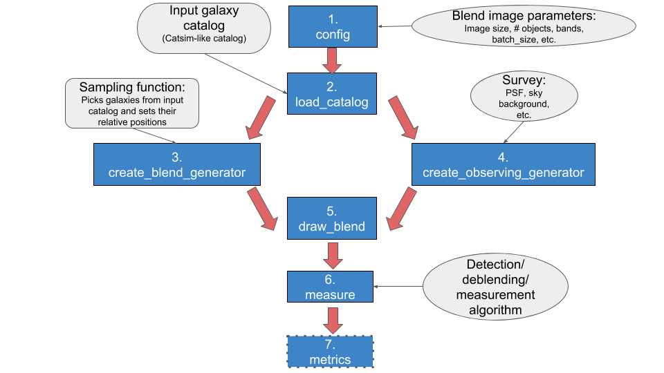

User Guide
==============

This document gives a detailed look into the work-flow of *BlendingToolKit* (btk). For a quick tutorial on how to run btk, see the jupyter notebook tutorials `here <tutorials.html>`_. This page is especially useful if you plan to use btk with your own detection/deblending/measurement algorithm.

The workflow of btk is shown here:

1. Set parameter values : define parameter values to create postage stamps, including size of stamp, number of objects per blend, and how many stamps are to be drawn in one batch -- i.e., the number of stamps btk will produce together in a singe batch. The observing survey name (e.g., LSST, DES), the name of the input catalog to draw objects from, and the names of the observing bands are also specified here. See `here <src/btk.config.html>`_ for more details.
2. Load Catalog : Reads the input catalog file. This step includes an option to input user-defined selection criteria.
3. Make blend catalog (*create_blend_generator*): Samples objects from the input catalog based on a user defined sampling function to create a catalog with parameters of each blend. This step outputs a generator that yields a new set of catalogs each time it is run with *next()*. This `notebook <https://github.com/LSSTDESC/BlendingToolKit/blob/master/notebooks/custom_sampling_function.ipynb>`_ shows several examples of user input sampling functions to create different blend catalogs.
4. Make observing conditions (*create_observing_generator*): Creates a class that contains information about the observing conditions such as PSF definition, noise level, etc. The default is to use the full-depth values corresponding to the survey named in *config*. However, a user can define a function to generate class with observing conditions of their choice. The user function can be such that it varies the observing conditions every time it's called. This `notebook <https://github.com/LSSTDESC/BlendingToolKit/blob/master/notebooks/custom_sampling_function.ipynb>`_ shows an example of a such a user input function that generates different observing conditions. Note that all blends drawn in a batch will be generated with the same observing conditions.
5. Draw blends (*create_blend_generator*): Simulates scene of overlapping objects, convolved by the PSF and with pixel noise (option set in *config*). Scene image is generated in each observing band. An "isolated" image of each object is also drawn without pixel contributions from other objects, in each band.
6. Detection/Deblending/Measure (*measure*): A user defined class to perform detection/deblending/measurement goes here. *btk* does not include any default algorithm; rather, it provides a framework for the user to run their choice of algorithm for the images generated in *create_blend_generator*. This `notebook <https://github.com/LSSTDESC/BlendingToolKit/blob/master/notebooks/run_basic.ipynb>`_ contains examples of running btk with `SEP <https://sep.readthedocs.io/en/v1.0.x/index.html>`_ (SourceExtractor with python) , `LSST science pipeline <https://pipelines.lsst.io>`_ and `SCARLET <https://scarlet.readthedocs.io/en/latest/index.html>`_.
7. Compute metrics (*metrics*): compares the true centroids, shapes, and flux values to those predicted by the user-provided *measure* algorithm. Currently, *metrics* assesses only detection performance by returning the number of objects correctly detected, the number that are undetected and the number of spurious detections. This `notebook <https://github.com/LSSTDESC/BlendingToolKit/blob/master/notebooks/evaluate_metrics.ipynb>`_ shows how this can be done.

*BlendingToolKit* can be run end-to-end using an input yaml config file, parsed by *btk_input.py*, which then runs btk with the defined parameters.
This is shown in detail in the tutorial `notebook <https://github.com/LSSTDESC/BlendingToolKit/blob/master/notebooks/with_config_file_input.ipynb>`_.

Utils
-------
*btk/utils.py* contains functions that the user may find useful in creating functions to perform detection/deblending/measurement in *measure*. For example, it shows how a class derived from *measure.Measurement_params* can be defined by the user for use with SEP, the LSST science pipeline or stand-alone SCARLET; see point 6 above.
